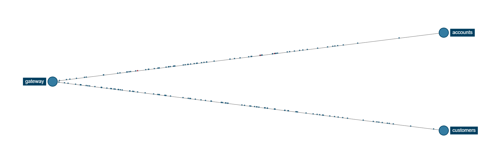
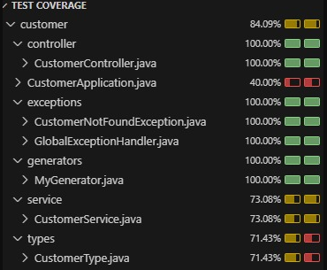
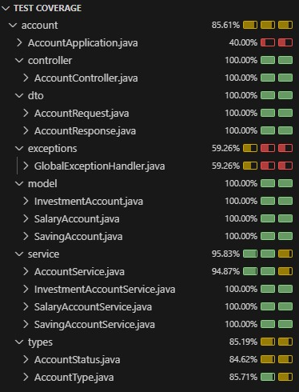
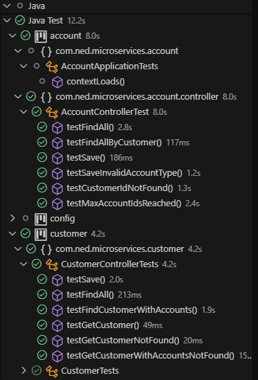

## Steps:

- Create discovery repo
- Create gateway repo:

Image from zipkin

- Create both accounts and customers repo
- Create config repo to simplify the configurations of the application.yml from all services

## Issues:

# EDA

* Needed specific events to be called for other services to listen to. 
* Proper solution was to have another repo where I create customer and accounts from with a UI
* Instead used a simply event to showcase the EDA flow from creating an account to adding the account to the customer

# TDD Testing

* Used rest assured to test
* Couldn't test some data I needed from the other microservice, solution was I needed both services on for the tests to work
* Had trouble to test exceptions using rest assured

# Setting up the one to many jpa relation
Can't use them between microservices, you use them only inside each service.

# Generate random 10 digits for customer id

* Used my own generator to handle this

# Needed hot reload on vscode
  
* - Added `spring-boot-devtools` dependency 
* Had to remove it from customer since it interfered with avro pathing

# The decisions between using enums or subclasses

* For account types I was planning to add methods for the accounts, which is why I made it into sub classes.
* Maybe for future cases I would have to make different controllers for the different types of account.

# Use of profiles

* Wasn't sure which entities I needed to use between different profiles
EX: If I was on dev profile I would still need to use the same methods/entities to test